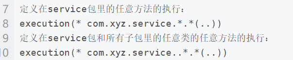

## spring AOP

### 关注点分离：不同问题交给不同的部分去解决

1、面向切面编程AOP正是这种技术的体现

2、通用化功能代码的实现，对应就是所谓的切面（Aspect）

3、业务功能代码和切面代码分开后，架构将变得高内聚低耦合

4、确保功能的完整性，切面最终需要被合并到业务中（织入Weave）

### aop的三种织入方式

编译时织入：需要特殊的java编译器  如AspectJ

类加载时织入：需要特殊的java编译器，如AspectJ和AspectWerkz

运行时织入：spring采用的方式，通过动态代理呃方式，实现简单。

### AOP主要名词概念

1、Aspect：通用功能的代码实现

2、Target：被织入Aspect的对象

3、Join Point ：可以作为切入点的机会，所有的方法都可以作为切入点

4、Pointcut：Aspect实际被应用在的Join Point，支持正则

5、Advice：类里面的方法以及这个方法如何织入到目标方法的方式

6、Weaving：aop的实现过程

### Advice的种类

1、前置通知（before）

2、后置通知（AfterReturning）

3、异常通知（AfterThrowing）

4、最终通知（After）

5、环绕通知（Around）

~~~java

package com.swjtu.aop;

import javax.servlet.http.HttpServletRequest;

import org.aspectj.lang.annotation.Aspect;
import org.aspectj.lang.annotation.Before;
import org.aspectj.lang.annotation.Pointcut;
import org.slf4j.Logger;
import org.slf4j.LoggerFactory;
import org.springframework.stereotype.Component;
import org.springframework.web.context.request.RequestAttributes;
import org.springframework.web.context.request.RequestContextHolder;
import org.springframework.web.context.request.ServletRequestAttributes;

@Aspect
@Component
public class HelloAspect {
    
	private static final Logger logger = LoggerFactory.getLogger(HelloAspect.class);
    
	@Pointcut("execution(* com.swjtu.controller..*.*(..))")
	public void method() {
	}
    
	@Before("method()")
	public void before() {
		//获取请求信息
		ServletRequestAttributes attributes = (ServletRequestAttributes) RequestContextHolder.getRequestAttributes();
		HttpServletRequest request = attributes.getRequest();
		//记录请求
		logger.info("url: "+request.getRequestURI());
		logger.info("ip: "+request.getRemoteAddr());
	}
}

~~~

note

> pointcut expression表达式解析及配置

### aop的实现：jdkProxy和Cglib

由AopProxyFactory根据AdvisedSupport对象的配置来决定

默认策略是如果目标类是接口，则用JDKProxy来实现，否则用后者

JDKProxy的核心：InvocationHandler接口和Proxy类

Cglib：以继承的方式动态生成目标类的代理

注意，如果一个类是final则无法使用Cglib代理

JDKProxy：通过java的内部反射机制实现

Cglib：借助ASM实现，ASM是一个字节码修改的框架

反射机制在类生成的过程中比较高效

ASM在生成类之后的执行过程中比较高效

### 代理模式：接口+真正实现类+代理类

代理模式是常用的Java设计模式，它的特征是代理类与委托类有同样的接口，代理类主要负责为委托类预处理消息、过滤消息、把消息转发给委托类，以及事后处理消息等。 

**静态代理**

~~~java
package demo1;

public interface Movable {

	public void move();
	
}

package demo1;

public class Tank implements Movable {

	@Override
	public void move() {
		// TODO Auto-generated method stub
		System.out.println("tank is moving");
	}

}

package demo1;

public class Proxy implements Movable{

	private Movable movable;

	public Proxy(Movable movable) {
		super();
		this.movable = movable;
	}

	@Override
	public void move() {
		// TODO Auto-generated method stub
		beforeMove();
		movable.move();
		afterMove();
	}
	
	private void beforeMove() {
		System.out.println("before move");
	}
	
	private void afterMove() {
		System.out.println("after move");
		
	}
	

}

package demo1;

public class Main {

	public static void main(String[] args) {
		Proxy proxy = new Proxy(new Tank());
		proxy.move();
	}
	
}

~~~

**动态代理**

JDKProxy，Cglib

### spring里代理模式的实现

1、真正实现类的逻辑包含在getBean方法li

2、getBean方法返回的实际是proxy的实例

3、proxy实例Spring采用JDK Proxy或CGLib动态实现

### spring事务

ACID

隔离级别

事务传播

