# jvm

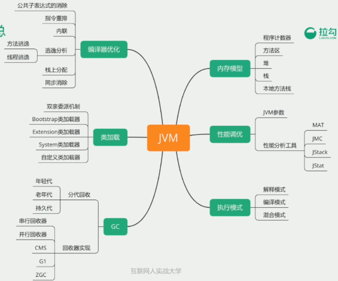

metaSpace和永久代都是方法区的实现

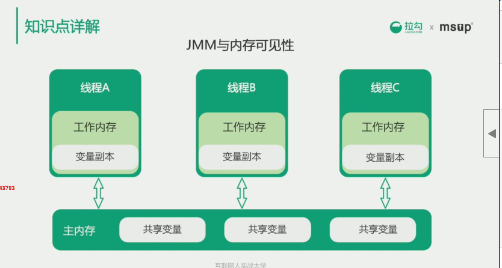

jmm的主要目标是定义程序中变量的访问规则

由于指令重排序的存在，这个写读的顺序可能会被打乱，所有jmm需要提供可见性，原子性，有序性

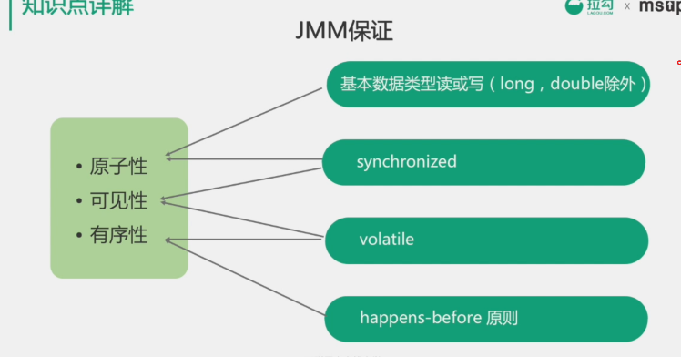

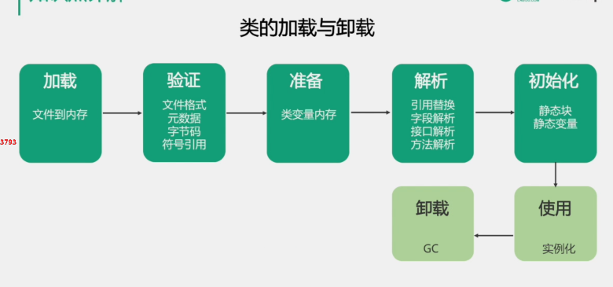

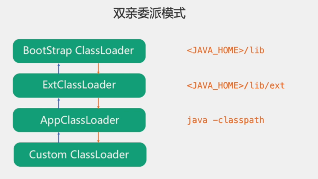

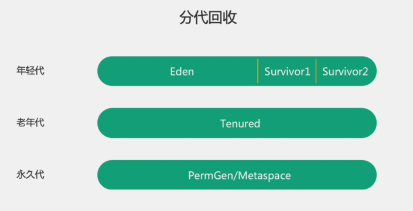

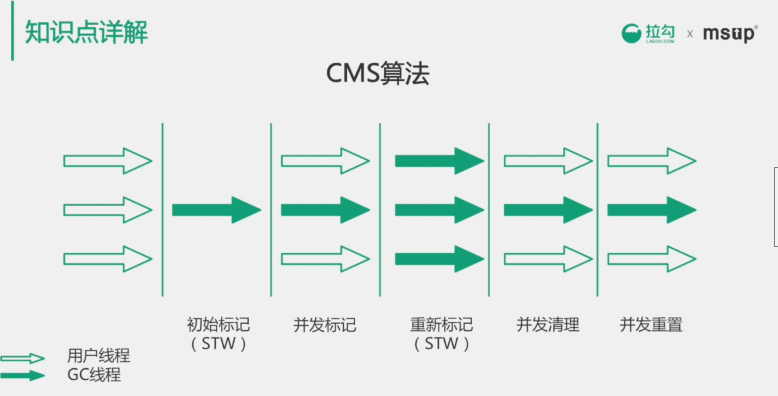

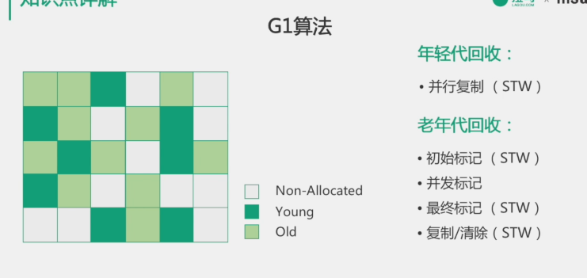

G1算法，减少高并发的同时，减少停顿

取消了年轻代和老年代的物理划分，采集**逻辑分带**，但依然是分带收集

把内存分为若干个区域，称为region

年轻代采用复制算法，老年代标记清除算法

每次只清除一部分的增量式清理，保证短停顿，所以叫做garbage first

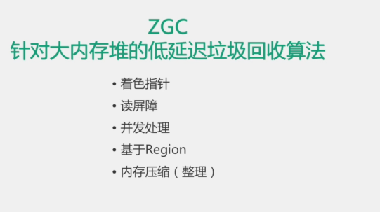

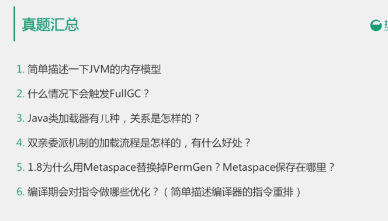

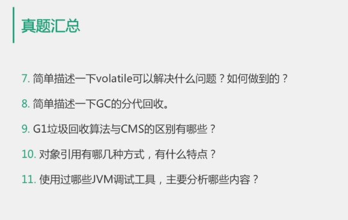

7、

保证可见性、不保证原子性
禁止指令重排序

> **观察加入volatile关键字和没有加入volatile关键字时所生成的汇编代码发现，加入volatile关键字时，会多出一个lock前缀指令**。lock前缀指令其实就相当于一个内存屏障。内存屏障是**一组处理指令，用来实现对内存操作的顺序限制**。volatile的底层就是通过内存屏障来实现的。

