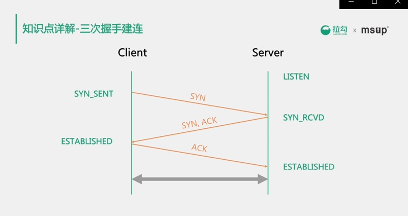
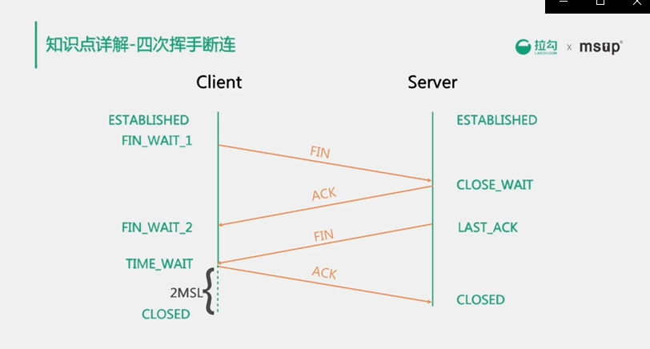

# 操作系统

## 进程与线程

### 区别和联系

进程是资源分配的最小单位，线程是程序执行的最小单位

进程使用独立的数据空间，线程共享进程的数据空间

### 线程调度

线程调度算法

时间片轮转调度，先来先服务调度，优先级调度，高响应比优先调度

### 线程切换步骤

线程上下文切换，线程切换代价

>  对于单核CPU来说（对于多核CPU，此处就理解为一个核），CPU在一个时刻只能运行一个线程，当在运行一个线程的过程中转去运行另外一个线程，这个叫做线程上下文切换（对于进程也是类似）。

> 线程切换时需要知道在这之前当前线程已经执行到哪条指令了，所以需要记录程序计数器的值，另外比如说线程正在进行某个计算的时候被挂起了，那么下次继续执行的时候需要知道之前挂起时变量的值时多少，因此需要记录CPU寄存器的状态。所以一般来说，线程上下文切换过程中会记录程序计数器、CPU寄存器状态等数据。

### linux下IPC（进程间通信）

进程间数据共享的场景，使用共享内存

进程间数据交换的场景，使用UnixSocket

### 协程

更轻量化，是在用户态进行调度，切换的代价比线程切换低很多

现在常用的工具是Quasar

## Linux常用命令

awk，top，netstat，grep

> ```
> top命令是Linux下常用的性能分析工具，能够实时显示系统中各个进程的资源占用状况。
> awk语言的最基本功能是在文件或者字符串中基于指定规则浏览和抽取信息，awk抽取信息后，才能进行其他文本操作。
> awk是一个强大的文本分析工具
> ```

## 内存分页管理与Swap

## 任务队列与CPU Load

## 扩展知识点

内存屏障

Memory Barrier 能够让 CPU 或编译器在内存访问上有序。

指令乱序

分支预测

CPU亲和性

Netfilter与iptables

# 网络知识

## 4/7网络模型

## TCP协议

### 三次握手

### 四次挥手

### 报文状态标志与链接状态

### Nagel算法与ACK延迟

解决小包问题，提高数据载荷比，对延迟比较敏感且发送频率较低的场景可以关闭nagel算法

特定情况下，nagel和ack延迟机制配合使用，可能出现延迟超时后才能回复ack包的问题

> \1. Nagle算法：
>
> 是为了减少广域网的小分组数目，从而减小网络拥塞的出现；
>
> 该算法要求一个tcp连接上最多只能有一个未被确认的未完成的小分组，在该分组ack到达之前不能发送其他的小分组，tcp需要收集这些少量的分组，并在ack到来时以一个分组的方式发送出去；其中小分组的定义是小于MSS的任何分组；
>
> 该算法的优越之处在于它是自适应的，确认到达的越快，数据也就发哦送的越快；而在希望减少微小分组数目的低速广域网上，则会发送更少的分组；
>
> 
>
> \2. 延迟ACK：
>
> 如果tcp对每个数据包都发送一个ack确认，那么只是一个单独的数据包为了发送一个ack代价比较高，所以tcp会延迟一段时间，如果这段时间内有数据发送到对端，则捎带发送ack，如果在延迟ack定时器触发时候，发现ack尚未发送，则立即单独发送；
>
> 延迟ACK好处：
>
> (1) 避免糊涂窗口综合症；
>
> 当发送端应用进程产生数据很慢、或接收端应用进程处理接收缓冲区数据很慢，或二者兼而有之；就会使应用进程间传送的报文段很小，特别是有效载荷很小。 极端情况下，有效载荷可能只有1个字节；而传输开销有40字节(20字节的IP头+20字节的TCP头) 这种现象就叫糊涂窗口综合症
>
> (2) 发送数据的时候将ack捎带发送，不必单独发送ack；
>
> (3) 如果延迟时间内有多个数据段到达，那么允许协议栈发送一个ack确认多个报文段；

### Keepalive

长时间没有数据发送的场景下，tcp保持长期可用的机制

### 滑动窗口与流量控制

## Http

### 协议

#### method

#### header

#### cookies

### urlEncode

> 对于Url来说，之所以要进行编码，是因为Url中有些字符会引起歧义。
>
> Url编码的原则就是使用安全的字符（没有特殊用途或者特殊意义的可打印字符）去表示那些不安全的字符。

### 状态码

404 503 302

### https

### http2协议

#### 多路复用

#### stream流式交互

#### 流量控制

#### 服务器推送

#### 头部压缩

## udp

非连接，非可靠传输，效率高

## Quic（http3）

基于udp协议，但是提供可靠保障和流量控制

避免http2协议的前序包阻塞（hol阻塞）

零rtt建连

fec前向纠错

# tcp细节

tcp是传输层协议，对应osi网络模型的传输层第四层；

基于链接，传输数据前需要先建立好链接，然后再进行数据传输，tcp链接一旦建立，就可以进行 双向通信；

tcp的传输是基于字节流而不是报文，将数据按照字节大小进行编号，接收端通过ack来确认收到的数据编号，通过这种机制保证接受数据的有序性和完整性，因此tcp能够提供可靠性传输

tcp还能提供流量控制，通过滑动窗口来控制数据的发送速率，

> 该协议允许发送方在停止并等待确认前发送多个数据分组。由于发送方不必每发一个分组就停下来等待确认，因此该协议可以加速数据的传输，提高网络吞吐量。

滑动窗口的本质是动态缓冲区，接收端根据自己的处理能力在tcp的header中动态调整窗口大小，通过ack应答包通知给发送端，发送端通过窗口的大小调整发送的速度

tcp考虑到处理网络问题导致大量重传导致网络恶化，tcp提供了拥塞控制，防止过多的数据注入到网络当中，这样可以使网络中的路由器或链路不致过载。主要用到了慢启动，拥塞避免，快启动，快速回复，四个算法。

> **TCP通过一个定时器（timer）采样了RTT并计算RTO(Retransmission TimeOut 重传超时时间)，但是，如果网络上的延时突然增加，那么，TCP对这个事做出的应对只有重传数据，然而重传会导致网络的负担更重，于是会导致更大的延迟以及更多的丢包**，这就导致了恶性循环，最终形成“网络风暴” —— TCP的拥塞控制机制就是用于应对这种情况。 
>
> (RTT(Round Trip Time)由三部分组成：链路的传播时间（propagation delay),末端系统的处理时间，路由器缓存中的排队和处理时间（queuing delay）。)
>
> **为了在发送端调节所要发送的数据量，定义了一个“拥塞窗口”（Congestion Window），在发送数据时，将拥塞窗口的大小与接收端ack的窗口大小做比较，取较小者作为发送数据量的上限。**
>
> 1.慢启动：意思是刚刚加入网络的连接，一点一点地提速，不要一上来就把路占满。 
> 连接建好的开始先初始化cwnd = 1，表明可以传一个MSS大小的数据。 
> 每当收到一个ACK，cwnd++; 呈线性上升 
> 每当过了一个RTT，cwnd = cwnd*2; 呈指数让升 
> 阈值ssthresh（slow start threshold），是一个上限，当cwnd >= ssthresh时，就会进入“拥塞避免算法” 
> 2.拥塞避免：当拥塞窗口 cwnd 达到一个阈值时，窗口大小不再呈指数上升，而是以线性上升，避免增长过快导致网络拥塞。 
> 每当收到一个ACK，cwnd = cwnd + 1/cwnd 
> 每当过了一个RTT，cwnd = cwnd + 1 
> 拥塞发生：当发生丢包进行数据包重传时，表示网络已经拥塞。分两种情况进行处理： 
> 等到RTO超时，重传数据包 
> sshthresh = cwnd /2 
> cwnd 重置为 1 
> 3.进入慢启动过程 
> 在收到3个duplicate ACK时就开启重传，而不用等到RTO超时 
> sshthresh = cwnd = cwnd /2 
> 进入快速恢复算法——Fast Recovery 
> 4.快速恢复：至少收到了3个Duplicated Acks，说明网络也不那么糟糕，可以快速恢复。 
> cwnd = sshthresh + 3 * MSS （3的意思是确认有3个数据包被收到了） 
> 重传Duplicated ACKs指定的数据包 
> 如果再收到 duplicated Acks，那么cwnd = cwnd +1 
> 如果收到了新的Ack，那么，cwnd = sshthresh ，然后就进入了拥塞避免的算法了


### 八种报文状态

### 滑动窗口的机制

### keepAlive机制

### Nagel算法


## 三次握手



#### 为什么三次和四次

Server段的SYN和ACK合并为一次发送，断开链接时，两个方向的数据，发送的停止时间可能是不同的，所以无法合并fin和ack发送

#### syn洪水攻击发生原因

server端收到client端的链接请求后，发送了SYN和ACK，但是Client端不进行回复，导致Server端大量链接处在SYN_RCVD状态，进而影响其他正常请求的建连

可以通过设置linux的参数SYN_ACK_reTrys =0 来加快半链接的回收速度


## 四次挥手



msl最大报文段生存时间

client端收到fin后，向Server发送ack，进入time_wait状态，等待2MSL后进入closed状态

#### 为什么需要等待2MSL后才能关闭链接

1、保证tcp协议的全双工链接能够有效关闭

2、保证这次链接中，重复的数据段能够从网络中消失，防止端口被重用的时候，可能会产生数据混淆

# add

#### osi七层模型

1、物理层   比特流

2、数据链路层  帧结构  交换机

3、网络层   路由器  ip协议  分组

4、传输层   tcp   udp   分段

5、会话层   不同机器上的户用建立会话    数据

6、表示层   信息的语法

7、应用层    http 

#### TCP/IP概念层

1、链路层

2、网络层

3、传输层

4、应用层

#### HTTP

主要特点：

1、支持客户/服务器模式

2、简单快速

3、无连接  完成一次请求后关闭连接

4、无状态  对事物没有记忆信息

#### http请求

请求行

（请求方法   url   协议版本）   

请求头

（键值对，多种信息）

请求体

#### http响应

状态行

（协议版本 状态码  状态码描述）

响应头

（键值对）

响应体

在浏览器地址栏键入url后，按下回车后经历的流程

1、dns解析

2、tcp连接

3、发送http请求

4、服务器处理请求并返回http报文

5、浏览器解析渲染页面

6、连接结束

#### http状态码

可能的请求

1XX  提示信息  表示请求已接受，继续处理

2XX  成功，表示请求已被成功接收，理解，接受

3XX  重定向，要完成请求必须进行更进一步的操作

4XX  客户端错误，请求有语法错误或是请求无法实现

5XX  服务器端错误，服务器未能实现合法请求


200 ok

400 bad request 客户端有语法错误

401 未授权

403  服务器拒绝服务

404  请求资源不存在

500  服务器错误

503 服务器当前不能处理，需要过一段时间


#### get和post

get将请求信息放在url，post放在请求体

 get一般做查询，post一般会改变数据库信息

get幂等性，安全性，post没有

get可以被缓存，被存储，post不行

#### cookie和session区别（让http有状态）

##### cookie

1、cookie是由服务器发送给服务器的特殊信息，以文本的信息存放在客户端

2、服务器再次请求的时候，会把cookie回发

3、服务器收到后，会解析cookie生成与客户端相对性的内容

##### session

1、服务器端的机制，在服务器上保存信息

2、解析客户端请求并操作sessionid，按需保存状态信息

##### session实现方式

1、使用cookie  jsessionid

2、使用url回写来实现

##### 区别

cookie在客户端  session服务器上

session更安全

session会让服务器负担加重

#### http和https区别

ssl（security sockets layer 安全套接层） 安全协议

1、https需要到ca申请证书

2、http是明文传输，https密文传输

3、连接方式不同，https是443端口，http使用80端口

4、https = http + 加密 + 认证 + 完整性保护，较http安全

