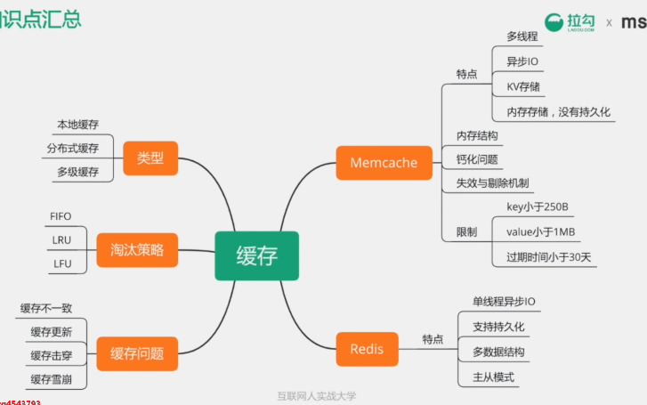
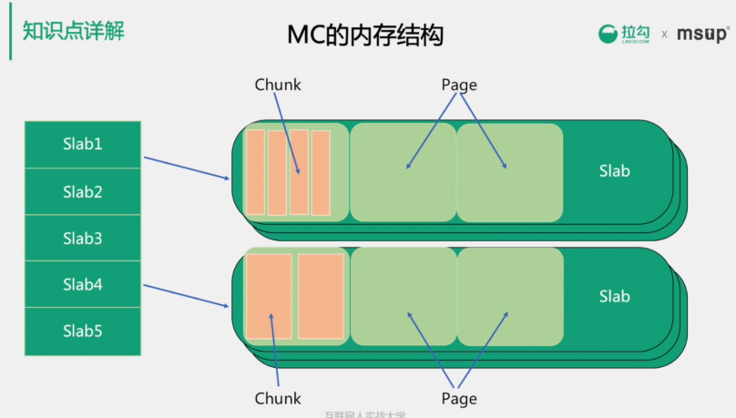
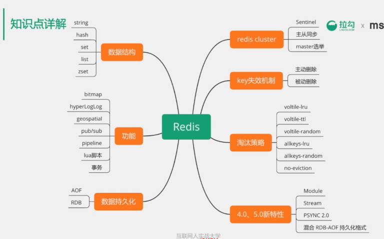
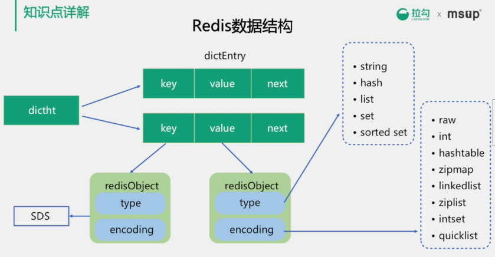
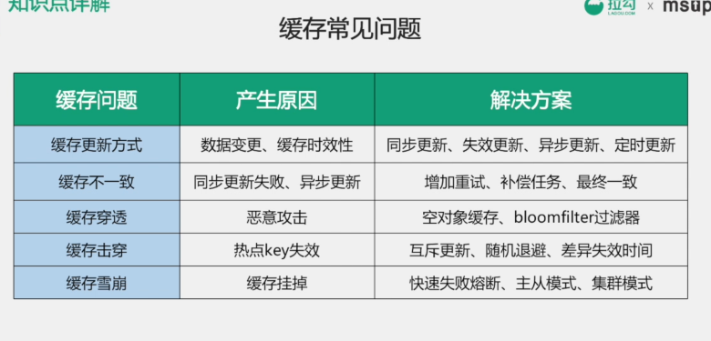
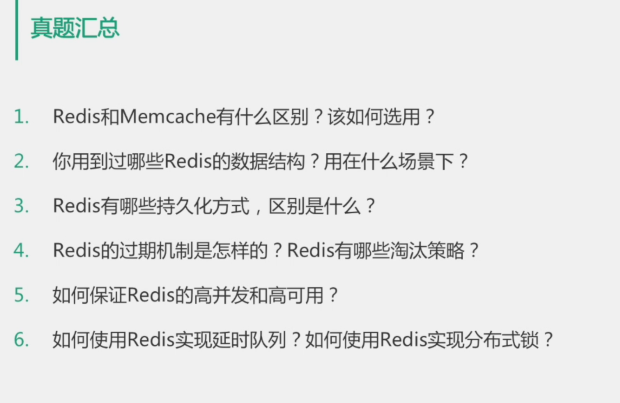

MC内存分为多个slab，slab机制主要是为了避免频繁malloc和free产生内存碎片问题

每种类型的slab用来保存不同大小的对象，每个slab又多个page组成，page的默认大小为1M，所以MC的存储对象对象默认不能超过1M

每个page内分为多个chunk，chunk就是实际用来保存对象的空间

Slab Allocator创建slab的参数有三个，分别是chunk大小的增长因子，chunk大小的初始值，page大小，运行时根据要保存的对象大小来逐个创建slab

##### MC钙化问题

使用MC来保存用户信息，比如单个对象大概是300byte，这是会产生大量384字节大小的slab，运行一段时间后，用户信息增加了一个属性，单个对象大小变成了500字节，这时，在保存对象时需要使用768字节的slab，而MC中的容量大部分都创建了384字节的slab，所以768的比较少，这时虽然384的slab内存大量空闲，但是768slab还是会更具LRU算法频繁地剔除缓存，导致MC的剔除率增高，命中率降低

##### 解决钙化问题

开启MC的auto-move机制，每10秒调整slab

##### redis事务

并非严格的事务，保证串行执行事务，并保证严格执行，但是不会回滚

> redis cluster有固定的16384个hash slot，对每个key计算CRC16值，然后对16384取模，可以获取key对应的hash slot

##### 缓存穿透

攻击者用不存在的信息频繁请求接口，导致查询缓存不命中，大量到达db层，在db层不命中，可用空对象标记，防止相同id再次访问，利用bloomfilter，bloomfilter是存在性检测，如果bloomfilter中不存在，那么数据一定不存在

##### 缓存击穿

某个热点数据失效时，大量针对这个数据的请求会穿透到数据源

解决方法

互斥锁更新，同一个进程中针对同一个数据不会并发请求db，减小db压力

6、使用redis 的 sorted set，使用时间戳作为score，使用zrangebyscore来使用之前的数据

