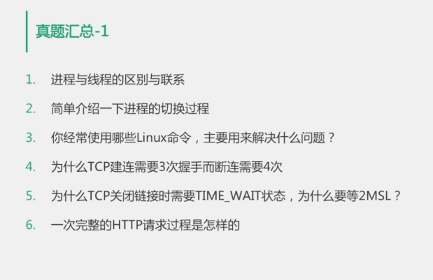
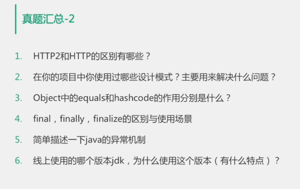

# 设计模式

##### 单例模式

线程安全实现

1、静态初始化（饿汉式）

在程序启动或单件模式类被加载的时候，单件模式实例就已经被创建

2、双重检查（懒汉式）

当程序第一次访问单件模式实例时才进行创建

3、单例注册表

> 如何选择：如果单件模式实例在系统中经常会被用到，饿汉式是一个不错的选择。
>     反之如果单件模式在系统中会很少用到或者几乎不会用到，那么懒汉式是一个不错的选择。

##### 工程模式

##### 代理模式

##### 构造者模式

##### 责任链模式

##### 适配器模式

##### 观察者模式

### 常用设计模式与应用场景

1、工程模式：spring如何创建bean

2、代理模式：motan服务的动态代理

jdk的动态代理

cglib动态代理

3、责任链模式：Netty消息处理的方式

4、适配器模式：slf4j如何支持log4j

5、观察者模式：GRPC是如何支持流式请求

6、构造者模式：PB序列化中的builder

### java基础Map

#### HashMap

1、数组加链表的实现方式

2、**容量大小**是2的幂次方的原因

可以用按位与的操作来计算余数，比求模快

3、并发读写会有什么风险

在容量超过填充因子时，进行rehash，因为hashMap为了避免尾部遍历，在链表的插入时，使用的是头插法，多线程场景下，可能会产生死循环

#### ConcurrentHashMap

1、并发控制与分段锁思想

2、1.8中的CAS自旋锁

3、红黑树的启用条件

##### 真题

2、

线程上下文的切换代价

切换会保存寄存器，栈等线程相关的现场，需要由用户态切换到内核态

可以用*vmstat*命令查看线程上下文的切换状态

6、

dns解析，tcp建连，http请求，http响应

